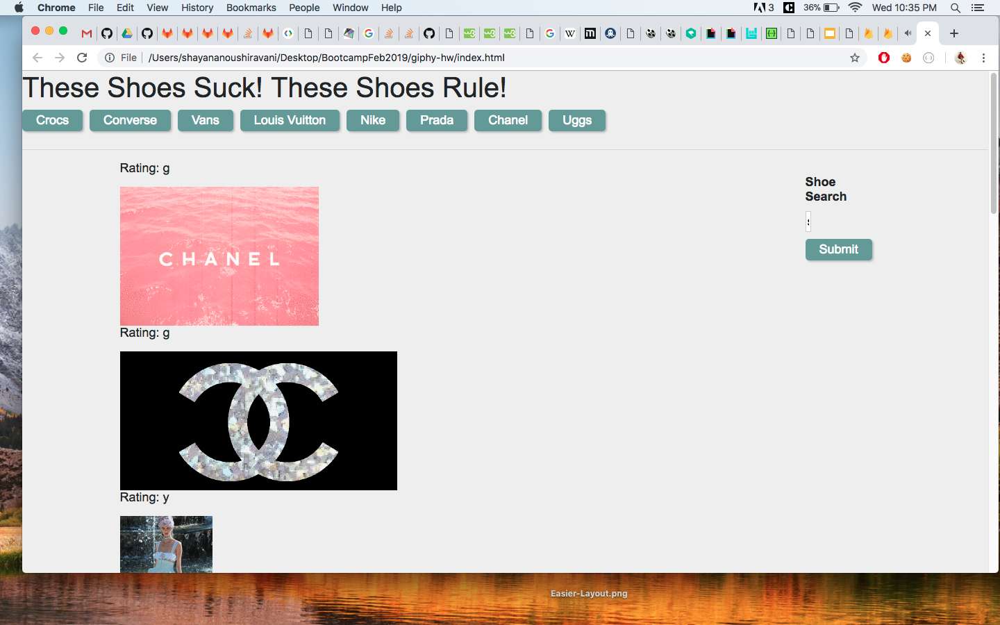
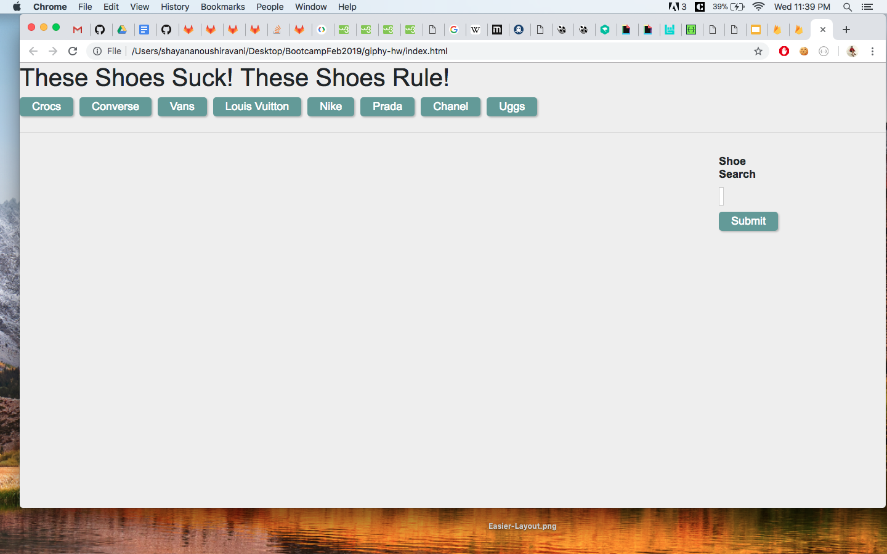
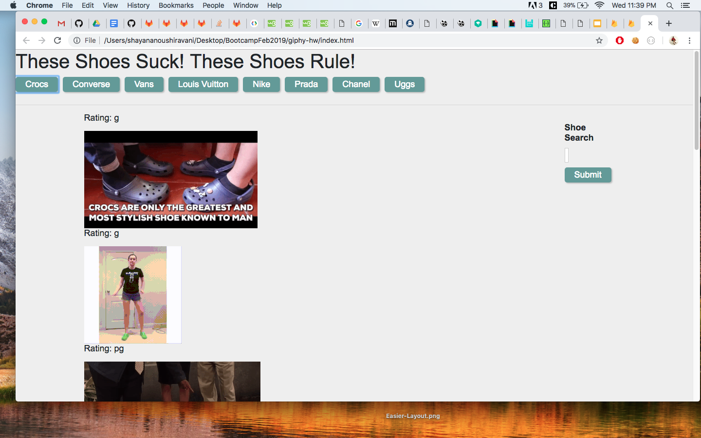
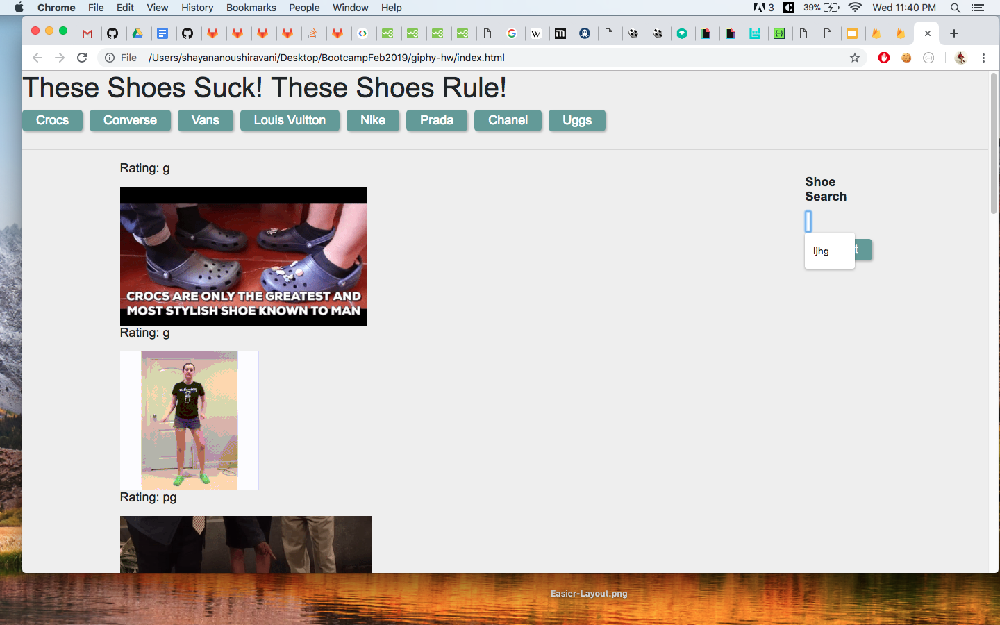

# giphy-hw

## Screenshots of interaction

## tutorial
1. click on a button to create a list of gifs relating to that button name
2. you can use the submit button to create your own Gif button!

## tech used
* html/css
* javascript
* jquery
* AJAX
* Giphy API 

# Author
* Shayan Anoushiravani

